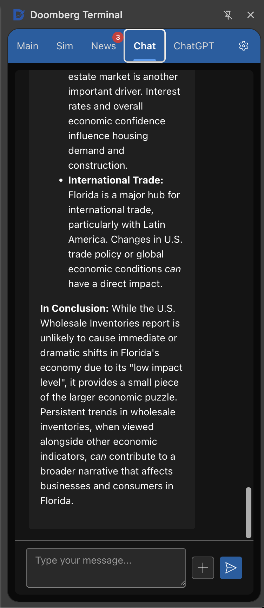
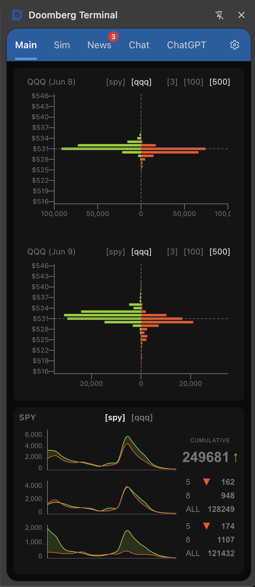

# Doomberg Terminal

This Chrome Extension performs algorithmic trading using Robinhood's web interface and market data.

This is an experiment to see how much we can push a Chrome Extension by building a full-featured stock options trading platform that gets data from the web. It's inspired by Playwright's automated browser and VSCode's Copilot side panel, which is why it uses VSCode's core libraries and Microsoft's FluentUI.

The Doomberg Terminal shows what's possible when you use a Chrome Extension side panel to browse and interact with websites. But this isn't meant for actual trading - it was never supposed to be practical. Plus, the data from Robinhood is occasionally corrupt causing the indicators to create false signals (I reported this to their support), which makes it pointless to add new features or polish existing ones.

(Broken data might actually be the best way to stop developers from scraping your site. Anyway... **I'm terrible at trading, so don't take any advice from me and definitely don't use this app to trade.**)

## Features

### Market Data & Trading

- **Predictive Chain Indicators**: Experimental algorithms that process entire option chain datasets to identify potential price movement patterns in underlying assets
  - **Premium Volume Distribution**: Bar chart visualization plotting strike prices against total premium flow (extrinsic value × volume), creating Gaussian distribution patterns that reveal anomalous premium concentration at specific strike levels and highlight unusual market positioning
  - **Cumulative Flow Threshold**: Interactive threshold chart displaying the cumulative difference in premium spending between calls and puts over time, visualizing directional bias in extrinsic value flows to identify bullish or bearish sentiment shifts
  - **Volatility Surface (aka "The Jane Street")**: Delta-IV scatter plot that maps implied volatility against interpolated option delta rather than strike price, revealing market maker hedging expectations where counter-intuitive IV patterns (higher call IV during downtrends, higher put IV during uptrends) signal institutional positioning for anticipated directional moves, potentially reflecting traders purchasing puts as insurance against long positions and calls as protection against short positions. (I don't understand this. It is very counter intuitive. Hopefully, someone will be able to explain this behavior.)
- **ETF Divergence Signals**: Real-time analysis of QQQ vs DIA percentage changes to detect market sentiment shifts between speculative growth (QQQ outperformance = bullish speculation) and defensive positioning (DIA outperformance = bearish fear-driven rotation)
- **Pricebook Heatmap**: Interactive heatmap visualization of order book data displaying bid/ask spreads, volume concentrations, and price levels with color-coded intensity mapping to identify support/resistance zones

<table>
  <tr>
    <td width="50%">
      
      
<em>Interactive AI Chat</em>

    </td>
    <td width="50%">
      
      
<em>Analytics Dashboard</em>

    </td>
  </tr>
</table>

### Automated Trading & Simulation

- **Strategy Automation**: Algorithmic trading engine that executes predefined strategies based on predictive options chain indicators and market signals with hyperparameter matrix, trailing stop loss, take profit, and other features
- **Forward Testing**: Real-time paper trading simulation using live market data to validate strategy performance without financial risk
- **Backtesting Engine**: Historical data analysis framework that tests trading strategies against past market conditions to optimize parameters and assess profitability

### Rapid Trade Execution

- **Ergonomic Trading Interface**: Streamlined, intuitive interface that enables rapid trade execution without navigating multiple pages

### AI-Powered News Intelligence

- **Truth Social Media Analysis**: Automated monitoring and analysis of political social media content using on-device AI processing to provide real-time market-relevant insights without requiring constant user attention
  - **Multi-Modal Content Processing**: Utilizes Transformers.js for on-device inference with OpenAI Whisper models for audio/video-to-text conversion and vision models for OCR image-to-text extraction and automated image description generation, ensuring privacy while enabling comprehensive content analysis of all media formats
  - **Intelligent Notification System**: Gemini 2.5 Pro or OpenAI analyzes text to identify market-moving statements and policy announcements, delivering contextual alerts with sentiment analysis and potential market impact assessments so users stay informed without monitoring social feeds manually
- **Economic Calendar Intelligence**: Real-time economic event tracking with automated data updates and comprehensive analysis to anticipate market movements
  - **Live Data Synchronization**: Scheduled service automatically updates economic indicators as they're released, providing immediate access to employment reports, inflation data, GDP figures, and central bank announcements with direct links to original government sources and documents
  - **AI-Powered Event Analysis**: Text generation models analyze economic releases in real-time, providing contextual explanations of data significance, historical comparisons, and potential market implications with automated notifications for high-impact events

### Why this is powerful

My friend wanted to scalp options based on the Federal Reserve report. An hour before the report's release, we started a video call. I had prepared a setup using [ChatGPT 4.5 with the deep research option](https://chatgpt.com/share/681b9d00-4b0c-8004-8a47-c8bbdd3a4478), with context ready for inputting the report immediately.

The night before, we searched for the fastest way to access the report and I discovered the direct-link pattern to the PDF of the report. We were positioned to start trading immediately.

However, we ran into an issue: after waiting a few seconds for the market to stop moving upward, as suggested by our indicators, we entered our positions—but then there was no movement for about a minute. I had shared the prompt with my friend, so I asked him to query ChatGPT about how long it usually takes after a Federal Reserve report release before market movements start. ChatGPT responded that historically it takes 2 to 5 minutes for traders to digest the report and start trading—exactly while we were sitting in our positions, waiting for the action to begin. It dropped the amount suggested by ChatGPT and ended up recovering later.

This has a lot of potential and requires further research.
